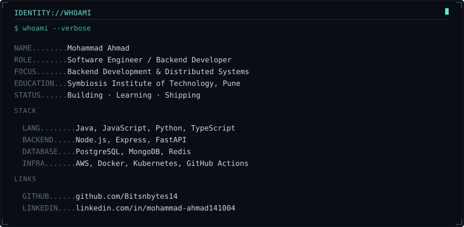
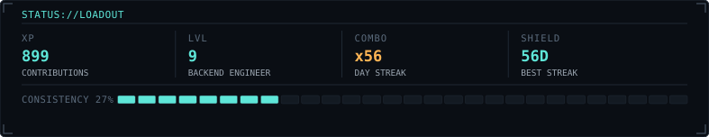

 

A scan-line sweeps the last year of activity once a day — commits "ping" the console the moment the sweep crosses their week, amber = the hottest days.

[ SECTOR: Bitsnbytes14 // STATUS: online ]

